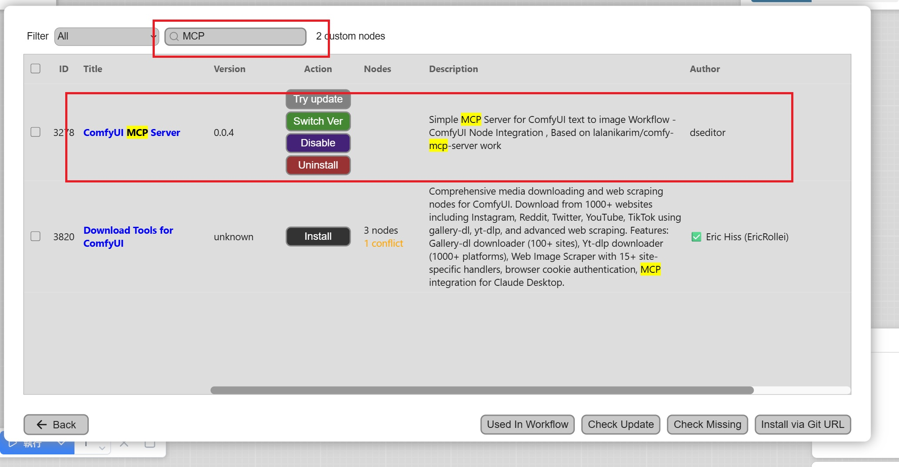
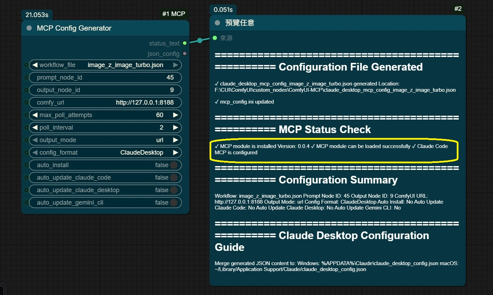
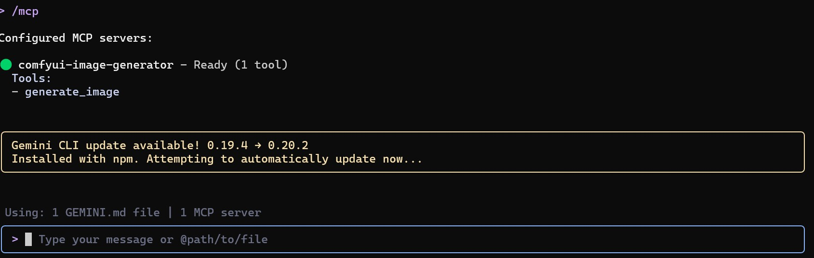
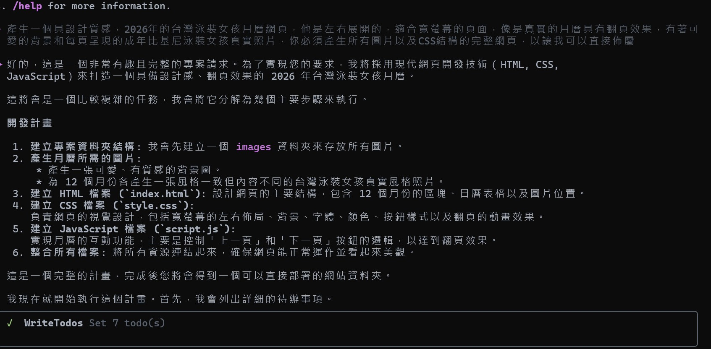
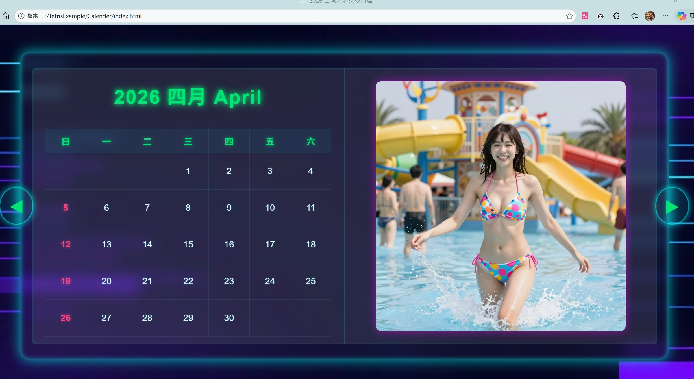

# ComfyUI-MCP

[繁體中文](README_zh-TW.md) | English

## Introduction to ComfyUI-MCP Node

First, you need to run the ZImage workflow at least once. Running the template workflow is sufficient.

In ComfyUI Manager, search for MCP:

If you've already installed it, you'll see icons for update, switch version, delete, and uninstall. If you haven't installed it yet, click "Install", and you'll be prompted to restart ComfyUI.

After MCP installation is complete, load the workflow JSON file ([`example/mcp.json`](example/mcp.json)) directly. It should look like this:

If you're manually adding nodes instead of using the workflow, all default values under `auto_install` are disabled. Please enable at least `Auto_install` and set `Workflow_File` to `Image_Z_turbo` (the default value), then execute the workflow to run it once.

After `Auto_install` completes, restart ComfyUI.

## Parameter Explanation

Let's explain the parameters above:

- **workflow_file**: Select the workflow JSON file. You can export any workflow as API and place it in the node's workflow folder to select it here. Note that it must be a T2I (Text-to-Image) workflow, as only text-to-image is currently supported.
- **prompt_node_id**: Text input node ID (e.g., "45")
- **output_node_id**: Image output node ID (e.g., "9")

You don't need to worry about the above two parameters initially, but if you customize the API, you can modify which node ID is for text and which is for the SaveImage output.

- **comfy_url**: ComfyUI server URL (default: `http://127.0.0.1:8188`)
- **auto_install**: ✅ Enable (required for first-time setup)

This must be enabled for first-time setup; otherwise, MCP cannot be used at all.

- **auto_update_claude_code**: ✅ Enable (if using Claude Code)
- **auto_update_claude_desktop**: ✅ Enable (if using Claude Desktop)
- **auto_update_gemini_cli**: ✅ Enable (if using Gemini CLI)

When these options are enabled, it will automatically search your user folder settings and install to CLI and Claude Code. When the workflow is updated, MCP will also be updated accordingly. If you haven't installed Claude Code or related tools and only have Gemini, the Claude-related options above and the MCP check will fail, which can be ignored.

## Other Parameters

The poll-related parameters indicate how many times to check and the wait time in seconds. If your GPU is slow and image generation takes a long time, you need to extend this duration and count. Basically, it checks once every 2 seconds for 60 times.

The `output_mode` default is URL to reduce token usage. If you want your Claude Desktop to directly display images, change this to webp.

After correct installation, the most important thing is this message:

The key is to confirm that MCP has been correctly installed in the ComfyUI system. Let's see how MCP works. For Gemini-CLI, after starting, type `/mcp` to check the status, and you'll see:

This indicates that your MCP is ready to generate images.

After each ComfyUI startup, your MCP will start automatically with ComfyUI. We can try to let MCP do some work, such as creating a set of beauty calendar. Gemini-CLI knows you need calendar images, so it will generate them directly:

During the process, it will use ComfyUI to generate the images needed for the calendar. After adjusting the layout, it will become:

That's it! All your web materials can be generated through ZImage. Just use ComfyUI-MCP + Gemini-CLI.
